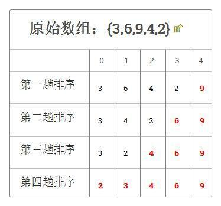
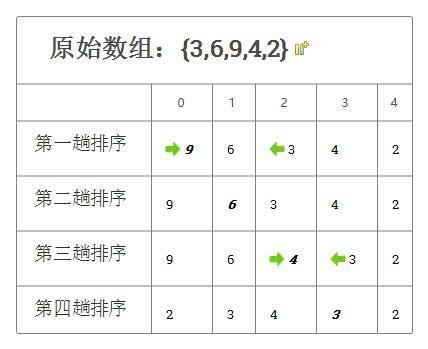
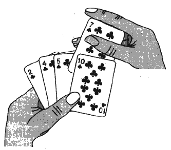

## 冒泡
冒泡排序（Bubble Sort），是一种较简单的排序算法，较稳定，用途广，时间复杂度为O(n^2)。

#### 原理



此示例一共进行了4次循环，每次确认一个最大的索引值。每进行一次循环时，从索引0开始往下进行比较，若索引0大于索引1则互相交换位置，否则不进行交换，然后接着往下进行比较，保证索引位置始终大于之前找到的数。

#### 代码

```
function sort(arrs) {
  const len = arrs.length;
  for (let i = 0; i < len - 1; i++) {
    for (let j = 0; j < len - 1 - i; j++) {
      if ( arrs[j] > arrs[j + 1]) {
        [arrs[j], arrs[j + 1]] = [arrs[j + 1], arrs[j]];
      }
    }
  }
}
```

## 选择排序
选择排序是冒泡排序的一种改进方法，他们都是每次循环找出一个最大或最小的数，区别在于冒泡排序会进行很多次交换数据，而选择排序用一个变量来暂存值，每趟循环只进行一次交换。

#### 原理


如图所示，每次循环找出最大值，与最小索引进行交换，这样就实现了从大到小的排序。

#### 代码
```
function sort(arrs) {
  const len = arrs.length;
  let index;
  for (let i = 0; i < len - 1; i++) {
    index = i;
    for (let j = i; j < len; j++) {
      if (arrs[index] < arrs[j]) {
        index = j;
      }
    }
    if (i !== index) {
      [arrs[i], arrs[index]] = [arrs[index], arrs[i]];
    }
  }
}
```

## 插入排序
插入排序即将一个数插入到一个已经有序的数字序列中，是一个稳定的排序方法，平均情况稍微比选择排序快。

#### 原理



想想一下你手中有4张手牌2、4、5、10，当你抽到1张7后，与10进行比较，比10小，往右挪10，与5进行比较，7>5，因此将牌放于次空隙中。而插入排序就是手牌从2张到任意张手牌进行此抽排方式的过程的抽象。

#### 代码
```
function sort(arrs) {
  for (let i = 1; i < arrs.length; i += 1) {
    let j = i;
    const newCard = arrs[j];
    while(j > 0 && arrs[j - 1] > newCard) {
      arrs[j] = arrs[j - 1];
      j -= 1;
    }
    arrs[j] = newCard
  }
  return arrs;
}
```

## 快速排序
快速排序是在实际中最常用的一种排序算法，速度快，效率高。它采用了分治法的思想，整个排序过程递归进行。

#### 原理
1. 选取数组中最左边的数作为基准。
2. 分区过程，将比这个数大的放到它的右边，小于它的数放到它的左边。
3. 对左右区间重复第二步，直到各区间只有一个数。

#### 代码
```
function quicksort(arrs, left, right) {
  if (left > right || left < 0 || right < 0) return;
  const middle = arrs[left];
  let low = left;
  let high = right;
  while (low < high) {
    while (low < high && arrs[high] >= middle) {
      high--;
    }
    arrs[low] = arrs[high];
    while (low < high && arrs[low] <= middle) {
      low++;
    }
    arrs[high] = arrs[low];
  }
  arrs[low] = middle;
  sort(arrs, left, low - 1);
  sort(arrs, low + 1, right);
  return arrs
}
```
