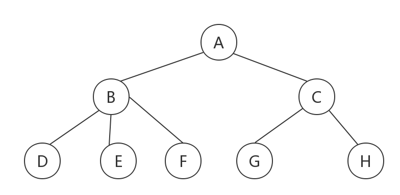
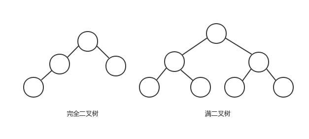
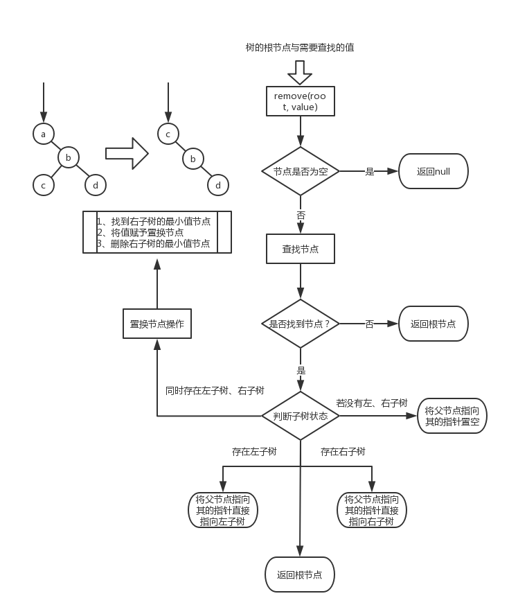

## 树

在计算机科学中，树是一种抽象数据类型（ADT）或是实作这种抽象数据类型的数据结构，用来模拟具有树状结构性质的数据集合，把它叫做“树”是因为它看起来像一棵倒挂的树，也就是说它是根朝上，而叶朝下的。它是由n（n>0）个有限节点组成一个具有层次关系的集合。

树结构本身可以用来描述很多事物，比如公司组织架构、家谱等，在计算机中应用就更广泛了，比如浏览器书签、文件系统、语法树、思维导图等等，除了描述事物，树还有一个作用是用于索引和查找的，它的形式特别多，诸如二叉树、平衡树、红黑树等。



它具有以下的特点：

- 根节点：一棵树有且仅有一个根节点，如图上的A
- 父节点：根节点没有父节点，除此以外每个节点都有且仅有一个父节点
- 子节点：树每个节点有零个或多个子节点，如B、C为A的子节点，D、E、F为B的子节点
- 树叶：，D、E、F、G、H这些没有子节点的节点，称之为树叶
- 兄弟节点：具有相同父节点
- 层次与深度：树是分层结构，从上到下，分别为第1层、第2层、……，而最大层数即为树的深
- 度：节点用于子树的数目
- 边：两个节点的连线

## 二叉树

所谓二叉树，与树最大的区别就是，每个节点最多只能有2个子节点，称之为左节点和右节点。二叉树有5种基本形态：


除此之外，二叉树还有2种基本类型：



- 完全二叉树：若设二叉树的高度为h，除第 h 层外，其它各层 (1～h-1) 的结点数都达到最大个数，第h层有叶子结点，并且叶子结点都是从左到右依次排布，这就是完全二叉树
- 满二叉树：除最后一层无任何子[节点](https://baike.baidu.com/item/%E8%8A%82%E7%82%B9/865052)外，每一层上的所有结点都有两个子结点二叉树

## 二叉查找树

二叉查找树（BinarySearchTree，BST）是一种特殊的二叉树，它也被叫做二叉搜索树、有序二叉树或排序二叉树，具有以下特性：


1. 若任意节点的左子树不空，则左子树上所有节点的值均小于它的根节点的值；
2. 若任意节点的右子树不空，则右子树上所有节点的值均大于它的根节点的值；
3. 任意节点的左、右子树也分别为二叉查找树；
4. 没有键值相等的节点。

**BST 算法查找时间依赖于树的拓扑结构。最佳情况是 O(log­2n)，而最坏情况是 O(n)**。

## 实现一个二叉查找树

在此用JavaScript的基本语法来实现了，首先定义可用于描述二叉树的基本数据结构：

```
function Node(value) {
  this.value = value;
  this.left = null;
  this.right = null;
}

function BinarySearchTree() {
  this.root = null;
}
```

在此会实现以下方法：

- [insert](#insert)，插入节点
- [search](#search)，搜索节点
- [remove](#remove)，删除节点
- [inOrderTraverse](#inOrderTraverse)，前序遍历
- [preOrderTraverse](#preOrderTraverse)，中序遍历
- [postOrderTraverse](#finalOrderTraverse)，后序遍历
- [breadthFirstTraverse](#breadthFirstTraverse)，广度优先遍历

还有一些有用的方法：计算最大最小值、获取树的高度、获取节点数目在此就不一一列举了，有兴趣的话可以自己实现以下。

### insert

对于插入节点操作，核心判断逻辑为一个递归操作，具体步骤为：

1. 判断节点是否为空，若为空则直接复制，否则进行下一步；
2. 插入值是否大于当前节点值，若大于则应该插入到节点右侧，将当前节点的右子树进行第1步的判断；
3. 插入值是否小于当前节点值，若小于则应该插入到节点左侧，将当前节点的左子树进行第1步的判断；
4. 若插入之与当前节点值相等，任意选择步骤2或者步骤3。

```
BinarySearchTree.prototype.insert = function(value) {
  var newNode = new Node(value);
  if (this.root === null) {
    this.root = newNode;
  } else {
    BinarySearchTree.insertNode(this.root, newNode);
  }
};

BinarySearchTree.insertNode = function(node, newNode) {
  if (node.value > newNode.value) {
    if (node.left === null) {
      node.left = newNode;
    } else {
      BinarySearchTree.insertNode(node.left, newNode);
    }
  } else {
    if (node.right === null) {
      node.right = newNode;
    } else {
      BinarySearchTree.insertNode(node.right, newNode);
    }
  }
};
```

### search

二叉查找树的最小值在最左边，最大值在最右边，因此在搜索的时候，只需要确定方向，然后直到找到值或指针为null时停止：

```
BinarySearchTree.prototype.search = function(value) {
  return BinarySearchTree.searchNode(this.root, value);
};

BinarySearchTree.searchNode = function(node, value) {
  if (node === null) {
    return null;
  } else if (node.value === value) {
    return node;
  } else if (node.value < value) {
    return BinarySearchTree.searchNode(node.right, value);
  } else {
    return BinarySearchTree.searchNode(node.left, value);
  }
};
```

使用非递归的方式也未尝不可：

```
BinarySearchTree.searchNodeNoRecursion = function(node, value) {
  var result = null;
  while (node) {
    if (node.value === value) {
      result = node;
      break;
    } else if (node.value < value) {
      node = node.right;
    } else {
      node = node.left;
    }
  }
  return result;
};
```

### remove

删除节点的操作相对会复杂一点，在此画了一张流程图：



以下是使用递归方法来实现的删除节点方法，好处在于不用储存父节点与指针方向，每次进行查找操作的同时，也会进行赋值操作：

```

// 删除指定值
BinarySearchTree.prototype.remove = function(value) {
  this.root = BinarySearchTree.removeNode(this.root, value);
  reutrn this.root
};

BinarySearchTree.removeNode = function(node, value) {
  if (node === null) {
    return null;
  } else if (node.value < value) {
    node.right = BinarySearchTree.removeNode(node.right, value);
    return node;
  } else if (node.value > value) {
    node.left = BinarySearchTree.removeNode(node.left, value);
    return node;
  } else {
    if (node.left === null && node.right === null) {
      return null;
    } else if (node.left === null) {
      return node.right;
    } else if (node.right === null) {
      return node.left;
    } else {
      var minRightNode = node.right;
      while (minRightNode !== null && minRightNode.left !== null) {
        minRightNode = minRightNode.left;
      }
      node.value = minRightNode.value;
      node.right = BinarySearchTree.removeNode(node.right, minRightNode.value);
      return node;
    }
  }
};
```

还有一种方法是使用常规的方法，先使用search的思路找到节点，同时记录父节点以及指针方向，再对节点进行修改操作：

```
BinarySearchTree.removeNodeBySearch = function(node, value) {
  var searchNode = node
  var parent = null
  var arrow = null
  while (searchNode) {
    if (searchNode.value === value) {
      break;
    } else if (node.value < value) {
      parent = node
      searchNode = searchNode.right;
      arrow = 'right'
    } else {
      parent = searchNode
      searchNode = searchNode.left;
      arrow = 'left'
    }
  }
  if (!searchNode) return node
  if (searchNode.left === null && searchNode.right === null) {
    parent[arrow] = null
  } else if (searchNode.left === null) {
    parent[arrow] = searchNode.right
  } else if (searchNode.right === null) {
    parent[arrow] = searchNode.left
  } else {
    var minRightNode = searchNode.right;
    while (minRightNode !== null && minRightNode.left !== null) {
      minRightNode = minRightNode.left;
    }
    searchNode.value = minRightNode.value;
    searchNode.right = BinarySearchTree.removeNodeBySearch(searchNode.right, minRightNode.value);
  }
  return node;
}

```

### 深度优先遍历DFS

#### preOrderTraverse

前序遍历，指先访问根，然后访问子树的遍历方式：

```
BinarySearchTree.prototype.preOrderTraverse = function(cb) {
  BinarySearchTree.preOrderTraverseNode(this.root, cb);
};
BinarySearchTree.preOrderTraverseNode = function(node, cb) {
  if (node === null) return;
  cb(node.value);
  BinarySearchTree.preOrderTraverseNode(node.left, cb);
  BinarySearchTree.preOrderTraverseNode(node.right, cb);
};
```


#### inOrderTraverse

中序遍历，指先访问左（右）子树，然后访问根，最后访问右（左）子树的遍历方式：

```
BinarySearchTree.prototype.inOrderTraverse = function(cb) {
  BinarySearchTree.inOrderTraverseNode(this.root, cb);
};
BinarySearchTree.inOrderTraverseNode = function(node, cb) {
  if (node === null) return;
  BinarySearchTree.inOrderTraverseNode(node.left, cb);
  cb(node.value);
  BinarySearchTree.inOrderTraverseNode(node.right, cb);
};
```

#### postOrderTraverseNode

后序遍历，指先访问子树，然后访问根的遍历方式：

```
BinarySearchTree.prototype.postOrderTraverse = function(cb) {
  BinarySearchTree.postOrderTraverseNode(this.root, cb);
};
BinarySearchTree.postOrderTraverseNode = function(node, cb) {
  if (node === null) return;
  BinarySearchTree.postOrderTraverseNode(node.left, cb);
  BinarySearchTree.postOrderTraverseNode(node.right, cb);
  cb(node.value);
}
```

### 广度优先遍历BFS

#### breadthFirstTraverse

简单来说，BFS在二叉树中的搜索，即沿着层级从左向右进行遍历，直到所有节点均被访问，它也被称为盲目的搜索法。在此的实现主要借助于数组，将数组作为队列使用，具体方法如下：

1. 将根节点放入数组中；
2. 从队列取出一个第一个节点，并将其存在的左子树与右子树一次放到队列最后；
3. 重复步骤2直到队列为空。

```
BinarySearchTree.prototype.breadthFirstTraverse = function(cb) {
  BinarySearchTree.breadthFirstTraverseNode(this.root, cb);
};

BinarySearchTree.breadthFirstTraverseNode = function(node, cb) {
  var queue = [node];
  var popNode = null;
  while (queue.length) {
    popNode = queue.shift();
    if (!popNode) break;

    cb(popNode);
    if (popNode.left) {
      queue.push(popNode.left);
    }
    if (popNode.right) {
      queue.push(popNode.right);
    }
  }
};
```

## 可视化

由于整个程序是一个抽象的分层结构，因此可视化是十分必要的一项工作。在canvas与svg之前没有过多犹豫，果断选择后者，因为这类图表注重的是节点增删改查，而且本身也不会有什么动画。

经过一番折腾，最终选用[d3-hierarchy](https://github.com/d3/d3-hierarchy)这个库，它用于分层数据的可视化，创建节点连接图、领接矩阵图等。

首先需要使用Hierarchy API创建分层数据结构，通过上几个章节我们构造出的二叉树的数据结构大致为：
```
{
  value: 1,
  left: {
    value: 2,
    left: {
      value: 4,
      left: null,
      right: null
    },
    right: null
  },
  right: {
    value:3,
    left: null,
    right: null
  }
}
```
而Hierarchy的结构为：
```
{
  "name": "Eve",
  "children": [
    {
      "name": "Cain"
    },
    {
      "name": "Seth",
      "children": [
        {
          "name": "Enos"
        },
        {
          "name": "Noam"
        }
      ]
    },
  ]
}
```
因此我们需要将二叉树的结构转化为上述结构才行，好在`d3.hierarchy(data[, children]) `的第二个参数就是子元素构造器，它允许函数返回空或是子元素数组。而二叉树每个节点有左子树和右子树之分，而Hierarchy的父元素可以有任意个子元素，因此我们在转化时，若二叉树某个节点只有右子树，当它传入chilren构造器时，将它返回`[{}, d.right]`，此时数组的第一个元素代表左子树，第二个代表右子树，空对象仅仅是为了占位，在可视化的时候我们将其排除在外即可。

最终使用`d3.tree()`将转化好的分层结构进行布局即可，我们就拥有了一个具有坐标点的二叉树。

值得一提的是，最开始我使用的d3进行控制的dom，语法十分繁琐，也不是很通用，而后采用了React进行dom的控制，d3只负责数据与逻辑层，它们简直是绝配，所以现阶段若再遇到这种可视化的工作，我一定会选用React与D3.js。

完整的二叉树实现代码与可视化程序在[这里](https://github.com/vv13/react-d3-bst)可以找到。

