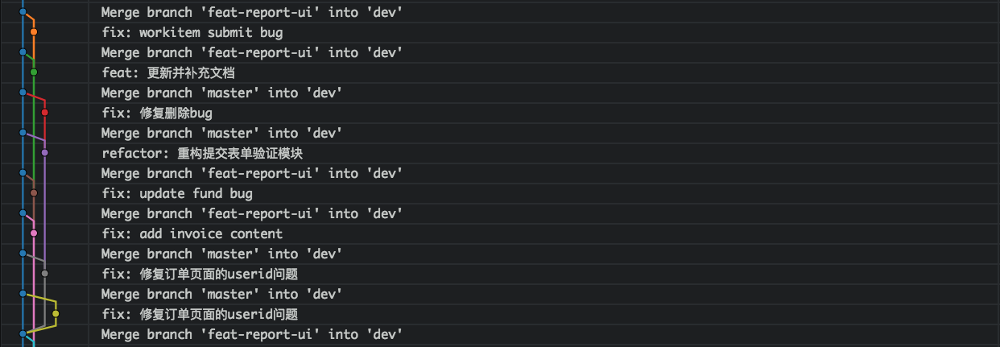

## git pull --rebase
从分支上拉取最新的代码时，往往会多出一条merge记录，这样有时不是我们所期望的，因为它会让整个提交线图变得难以理解：



我们期望的分支图也许时这样的：


只需要将git pull -> git pull --rebase。rebase的好处就在于，它会将当前新的提交记录，全部追加到远程提交信息记录之后:
```
合并前：
        D---E master
      /
A---B---C---F origin/master

merge合并：
    D--------E  
  /           \
A---B---C---F---G   master, origin/master

rebase合并：
A---B---C---F---D---E   master, origin/master
```

如果遇到冲突，请将冲突解决后执行: `git rebase --continue`。它也有两面性，至于谁好谁坏，慎用就行了。

## 获取远程库的更新
普通的工作流程一般是先folk整个工程到本地，再添加上游分支：
```
git remote add upstream https://xxx.git
```

这样一来，我们就可以获取远程的更新到当前分支：
```
git pull upstream master
```

若拉取本地不存在的分支，则可以使用这条命令：
```
git checkout -b new_branch upstream/new_branch
```

## 推送多个远程库
用法：

```
$ vim ~/.git/config

[remote "upstream"]
        url = git@gitlab.main.com:project.git
        url = git@github.main.com:project.git

$ git push upstream
```

解释：通过编辑config文件，给远程库多添加一个url，那么再执行push操作时，就可以同时push两个库，如上github与gitlab仓库的项目都会更新。

## 合并多个提交
有些时候，本地会做多个commit提交，但是在push之前，合并为1个提交会显得更清晰，此时就需要借助`git rebase -i HEAD~N`了，其中N代表的是最近几次提交，执行后将需要合并的commit从pick改为squash，再重写提交记录即可。

## 更改提交人
在有一次和小伙伴协作代码时，由于需要伪造成同一个身份，让代码管理者看commit历史以为是同一个人做的，因此就用到了--author参数，提交的格式为：`name<mail>`，比如：`git commit -m 'feat: something' --author="TJ<mail@gmail.com>"`，这是通过git log即可看到作者信息发生了变化。

## Stash

用于保存和恢复工作现场，如在切分支时、拉取代码、热修复时，需要将当前修改的文件内容储存起来，完成另一个场景的个工作，再恢复现场，以下是一些常用命令：

- git stash

  保存当前的工作进度。会分别对暂存区和工作区的状态进行保存

- git stash push -m "message..."

  与 `git stash` 作用相同，可以自定义信息

- git stash list

  显示进度列表。此命令显然暗示了git stash 可以多次保存工作进度，并用在恢复时候进行选择

- git stash pop [--index] [<stash>]

  如果不使用任何参数，会恢复最新保存的工作进度，并将恢复的工作进度从存储的工作进度列表中清除。

  如果提供参数（来自 `git stash list` 显示的列表），则从该 `<stash>` 中恢复。恢复完毕也将从进度列表中删除 `<stash>`。

  选项--index 除了恢复工作区的文件外，还尝试恢复暂存区。

- git stash apply [--index] [<stash>]

  除了不删除恢复的进度之外，其余和 `git stash pop` 命令一样

- git stash clear

  删除所有存储的进度

## 其他

- 删除远程分支：$ git push origin --delete <branchName>
- 删除远程分支2：$ git branch --delete --remotes <remote>/<branch>

- 推送本地分支：$ git push <远程主机名> <本地分支名>:<远程分支名>

## 快速拉取仓库

对于大型项目来讲，我们往往光拉取代码就会耗费很多时间，这是因为历史提交记录占了很大的储存空间，这时可以用 `--depth=1`，代表只保留最近一个提交信息，来看看拉取`React`仓库使用前后的对比：
- `git clone https://github.com/facebook/react.git react`，占用 180M。
- `git clone https://github.com/facebook/react.git react --depth=1`，占用 22M。

## 远程分支覆盖本地分支
假若远程拉取了新的分支线，想将本地的分支同步为远程分支，可以执行以下操作：
```
git fetch --all
git reset --hard origin/master
```

## Remote 相关
- 修改 Remote 地址：`git remote set-url origin [ORIGIN_URL]`
- 添加 Remote 地址：`git remote add [ORIGIN_NAME] [ORIGIN_URL]`
- 删除 Remote 地址：`git remote remove [ORIGIN_NAME]`

## 修改提交 Author
在提交代码之前，我们需要确认一下当前的提交作者信息，确保是使用的正确的名称与邮箱：
```
git config user.name 
git config user.email
git config --global user.name // 加上 --global 默认查看全局默认值
git config --global user.email
```

git config 命令首先会寻找当前文件夹下的`.git/config`，若不存在则取`~/.gitconfig`中的值作为默认值，若需要进行修改则直接在命令后加上相应值。
