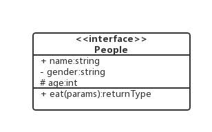
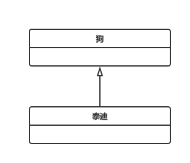
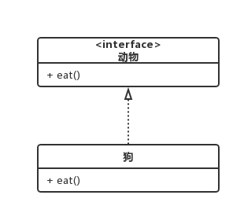
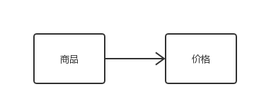
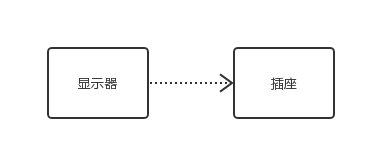
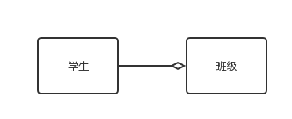
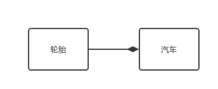
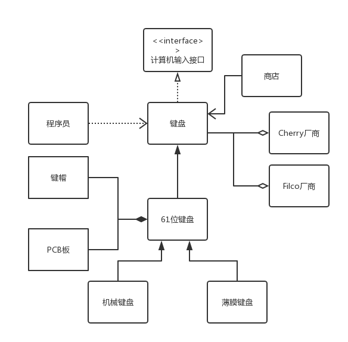

#### 属性
一个类图大概长这样：



其中，属性有三种符号表示：
- `+`：表示public
- `-`：表示private
- `#`：表示protected

属性完整表示方式为：
```
可见性 名称:类型 [ = 缺省值 ]
```

方法完整表示方式为：
```
可见性 名称(参数列表) [ : 返回类型]
```

`<<interface>>`代码此类为接口类。

#### 继承


空心三角形 + 直线，上图表示泰迪继承于狗。

继承关系是is-a的关系，如果a is b，就可以称之为继承关系。

#### 实现


空心三角形 + 虚线，上图表示狗是动物的实现。

在此动物是一个抽象的概念，无法直接用于使用，在Java中一般表现形式为接口，只有通过子类进行实现后才能使用。

#### 关联


箭头 + 实线，上图表示商品与价格关联。

箭头方向若为A指向B，代表B为被关联者，B存在于A的变量中，A需要知道B，而B不用知道A。

关联表示对象间彼此了解，默认不指定方向，也可双向关联，也可自关联用于描述运行时会用到另一个对象的关系。在实现时，关联对象通常以成员变量形式存在。


#### 依赖


箭头 + 虚线，上图表示显示器依赖插头。

与关联不同的是，它是一种临时性的关系，通常在运行时产生，并随着运行时变化。

#### 聚合


空心菱形 + 实线表示，学生聚合为班级。

菱形指向为表示整体由部分构成，就算整体不存在了，部分依然存在。

#### 组合


实心菱形 + 实现，上图表示汽车由轮胎组成。


#### 示例
在此绘制一个关于键盘的UML类图来进行简单说明：



首先，**键盘**属于电脑的输入设备，电脑预先定义好了相关通讯协议，因此键盘是计算机输入设备的实现。俗话说，工欲善其事，必先利其器，对于**程序员**来讲，一款手感好的键盘是不可获取的，因此程序员依赖于键盘。为了购买键盘我们需要去**商店**，因此可以说商店与键盘关联，商店拥有键盘的实例。有许许多多的**厂商**会生产键盘，常见的如Filco、Cherry，不同的键盘聚合为不同的厂商。

键盘有很多种键位，如**61键**（60%键盘）、87键（无小键盘）、104键（标准键盘），因此61键位键盘继承于键盘，是键盘的一种实现。很容易看出机械键盘与薄膜键盘也是61位键盘的实现，他们是继承关系。**键帽**、**PCB板**组成了键盘，它们属于键盘的一部分，为组合关系。

到这里就介绍完了，你学会了吗？没记住也没关系，常回来看看。

#### 参考
- [看懂UML类图和时序图 — Graphic Design Patterns](https://design-patterns.readthedocs.io/zh_CN/latest/read_uml.html)
- [UML association is relationship between classifiers to show that instances of classifiers could be either linked to each other or combined into some aggregation.](https://www.uml-diagrams.org/association.html#binary-association)
