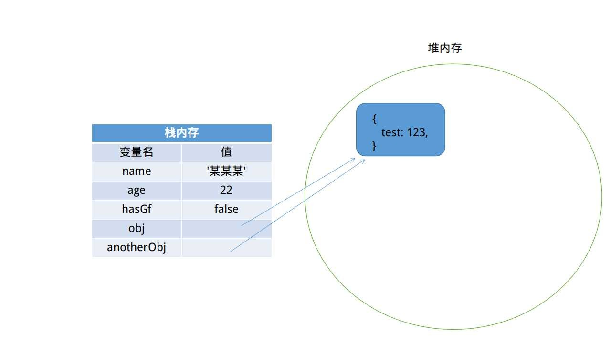

## 栈内存与堆内存
js变量分为基本类型与引用类型, 所有变量都储存在函数方法体内,但根据类型的不同实际存储位置不一样.基本类型存储于栈内中,而引用类型存于堆内存中, 我们先来看看什么是堆内存与栈内存.初始化以下代码:

```javascript
const name = '某某某';
const age = 22;
const hasGf = false;
const obj = {
  test: 123,
}
const anotherObj = obj;
```

它们在内存中的结构如图：



* 栈内存(stack): 如int,string,number等基本变量,他们的大小是固定的,由系统分配栈存储空间
* 堆内存(heap):对象的属性是动态扩展的,系统并不知道它栈多少空间,因此创建一个对象, 会在堆内存中开辟一个不固定的空间, 然后返回首地址指针给函数内的变量进行引用

由上图即可看出, 对基本类型与引用类型进行值传递也会不一样:

* 基本类型直接在栈内存中进行复制值
* 引用类型只是将堆内存中的索引传递给变量,它们实际指向的是同一个对象

既然涉及到变量的使用与改变, 难免会遇到栈溢出,堆溢出等问题,以下是一个递归的求和函数, 当调用多次,就会发生栈溢出:

```

function test(n) {
  if (n === 1) {
    return 1;
  }
  return n + test(n - 1);
}
test(10000); // 50005000
test(100000); // Uncaught RangeError: Maximum call stack size exceeded(…)
```

正是因为每个函数栈中限制了大小, 而每次递归调用都会保存着当前函数栈的信息,等待下一函数执行完返回结果, 执行test函数5次,栈空间变化为:

```
test(5)
5 + test(4)
5 + (4 + test(3))
5 + (4 + (3 + test(2)))
5 + (4 + (3 + (2 + test(1))))
5 + (4 + (3 + (2 + 1)))
5 + (4 + (3 + 3))
5 + (4 + 6)
5 + 10
15
```

正由于每递归一次都会在内存中形成一个调用帧,于是就会形成栈溢出,我们可用尾递归对栈调用进行优化,尾递归的含义为:在函数尾部调用函数本身,因为只调用了自身,当前栈大多数局部变量都不需要进行保存,因此就不会出现栈溢出了,以下是用尾递归进行实现:

```
function test(n, count) {
  if (n === 0) {
    return count;
  }
  return test(n - 1, count + n);
}
test(100000); // Uncaught RangeError: Maximum call stack size exceeded(…)
```

上述还是会出现栈溢出，究其结果是因为es6没有进行尾递归优化：
```
Temporarily Removed in Babel 6
Only explicit self referencing tail recursion was supported due to the complexity and performance impact of supporting tail calls globally. Removed due to other bugs and will be re-implemented.
```


那么为了消除栈溢出,只能使用另一种方法了:蹦床(Trampolining), 蹦床函数会将函数的递归调用转换成循环:

```
function trampoline(f) {
    while (f && f instanceof Function) {
        f = f();
    }
    return f;
}

function test(x, count) {
    function recur(x, count) {
        if (x > 0) {
          return recur.bind(null, x - 1, count + x);
        } else {
          return count;
        }
    }
    return trampoline(recur.bind(null, x, count));
}

console.log(test(100000, 0)); // 5000050000
```


## 内存泄漏
javascript具有自动垃圾回收机制(GC),当变量所属的函数执行结束后,就会等待垃圾回收器对其内存进行释放,回收器主要有使用的是标记清楚策略,核心概念为：

1. 遍历所有可访问的对象。
2. 回收已不可访问的对象。

因此我们应当特别小心那些造成作用域改变的对象或者没有留意到对象的引用,这样它们的内存就会得不到释放,常驻于内存影响性能.


#### 闭包拾遗
通过闭包,内部函数可以访问外部函数的变量,要特别小心在闭包内引用了外部函数的变量后,将内部函数返回出去时, 由于内部函数依赖外部函数的变量,因此不会失去引用而被垃圾回收机制释放掉,直到指向内部函数的指针为null:

```
function outerFn() {
  var a = 0;
  function innerFn() {
    console.log(a++);
  }
  return innerFn;
}

var fn = outerFn();
fn(); // 0
fn(); // 1
```


#### 在函数内创建全局变量
若在方法内不带var或let等关键字访问变量,若变量不存在的画就会创建一个全局变量, 从而造成无法释放掉内存,也有可能是构造函数自身进行了调用,this就会指向全局对象:

```
function Test() {
  hehe = 123;
  this.a = 1;
}
Test();
console.log(hehe, a); // 123, 1
```

#### 循环引用
如果dom元素操作不当, 很容易造成非常规的内存占用:

```
function assignHandler () {
  var element = document.getElementById('someElement');
  element.onclick = function () {
    alert(element.id);
  };
}
```

由于匿名函数引用了element, 因此element并不会被垃圾回收器回收,在代码中不要直接通过对象获取属性:

```
function assignHandler () {
  var element = document.getElementById('someElement');
  var id = element.id;
  element.onclick = function () {
    alert(id);
  };
  element = null;
}
```
