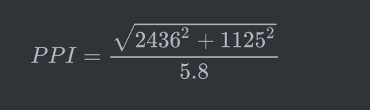

## 移动开发中涉及的单位
熟记名词就能装逼如风，却不能成为一名好的开发者，在这里与大家一起先复习一遍开发中涉及到的单位，不论是为了技术梦想还是为了人生目标，都应该好好了解一下。


#### 屏幕尺寸
即屏幕对角线之间的距离，单位为英寸(inch)。单位换算如下：
- 1 inch = 2.54 cm
- 1 cm = 0.3937inch

#### 分辨率
分辨率大致分为两种：
1. 屏幕分辨率，例如屏幕分辨率为1920 x 1080，代表着设备屏幕水平方向有1024个像素点，垂直方向有1080个像素点，显示屏固定的情况下，分辨率越高画面越精细。
2. 图像分辨率，通常情况下，图像的分辨率越高，所包含的像素就越多，图像就越清晰，印刷的质量也就越好。同时，它也会增加文件占用的存储空间。

#### 像素

像素(pixel)是组成图像的最小显示单位，它是一个抽象的单位，而不是具体的长度，在Web开发中通常将像素分为两类：

1. **设备像素**，指设备的物理像素，任何设备屏幕的物理像素的数量都是不变的。
2. **CSS像素**，指设备的逻辑像素，也称为独立像素，是一个相对的单位大小。1个CSS像素在不同设备上对应不同的物理像素数，这个比值称为DPR(Device Pixel Ration，设备像素比)。

以Phone 5为例，它的设备像素为640/1136px，设备像素比为2，因此CSS像素为320/568px。设计师通常根据固定的设备像素进行设计，前端工程师再根据不同设备的特性，将物理像素转换为相应的逻辑像素。


#### 设备像素比

设备像素比缩写为DPR(Device Pixel Ratio)或者DPPX(Dots Per Pixel)，一般用于表示一个CSS像素等于几个物理像素：`DPR=物理像素/逻辑像素`。当dpr为2时，1个CSS像素由4个物理像素组成，可通过`window.devicePixelRatio`获取当前设备的dpr。


#### 像素密度

像素密度也叫做屏幕密度，缩写为DPI(dots Per Inch)或PPI(Pixels Per Inch)。以iphone X举例，设备的参数如下：

- 水平分辨率：2436px
- 垂直分辨率：1125px
- 屏幕对角线尺寸：5.8英寸

为了计算像素密度，我们通常需要求出屏幕对角线的分辨率，再除以屏幕对角线尺寸。根据勾股定理(直角三角形的两条直角边的长度的平方和等于斜边长的平方)，得以下表达式：


tricks：

- DPI与PPI其实指代的东西是不同的，需要注意语境，人们多为混用。
- 根据实验，普通人眼在一般阅读距离的极限就是300~400DPI，所以说目前的高清屏的DPI也在300左右。
- 普通的非彩色喷墨式打印机通常设定在300dpi，根据公式：`像素=英寸 x dpi`，可以通过调整图像像素大小，获取所需要的实际尺寸大小。

以寸照为例，通过搜索，`1寸=2.5cm x 3.5cm=413 x 295`，聪明的你肯定不需要过多的说明，看以下换算公式：


---

## viewport(视口)

viewport概念通常存在于移动端，因为pc端的视口大小与窗口相等，而在移动设备的浏览器中，一般视口的默认大小会比设备逻辑的独立像素要大，并可拖过手动缩放来浏览网页，这个窗口就称之为viewport，普通设备浏览器的默认viewport通常为980px或1024px，随之的副作用就是设备的横向滚动条。

### 布局视口

手机浏览器默认会去适应那些不是为移动端设计的网站，因此会为viewport设置一个默认值，一般为980px，这样大部分电脑端页面都能正常显示了，只是比例看起来很小，因此布局视口通常是大于浏览器可视区域，不进行缩放的情况也会有额外的额外滚动条，这个宽度可以通过`document.documentElement.clientWidth`来进行获取，它跟设备的大小没有关系。


### 视觉视口

用户默认看到的网站区域，即为视觉视口大小，放大会使视觉视口大小变小，因为整个屏幕显示的CSS像素更少了，而缩小会使其变大，缩放不会影响布局视口大小。


### 理想视口

布局视口并不是一个理想宽度，对设备而言，设备宽度即是理想视口宽度，通常可见viewport的一个属性：`width=device-width`，这一行代码告诉浏览器将视口大小设置为理想视口大小。


### viewport标签

```
<meta name="viewport" content="width=device-width, initial-scale=1">
```

viewport标签专为移动端的设备而设计，以上是一个最常用的标签，它可以设置以下几个特性：

- width：viewport的宽度大小，如640，也可设置如device-width使其等于设备的宽度
- height：viewport的高度
- initial-scale：初始缩放比例
- maximum-scale：允许用户缩放的最大比例
- minimum-scale：允许用户缩放的最小比例
- user-scalable：是否允许手动缩放


### 视口单位

- vw，1vw等于视口宽度的1%
- vh：1vh等于视口高度的1%
- vmin：选取vw和vh中更小的一个
- vmax：选取vw和vh中更大的一个

视口单位与**%**很像，但一个依赖于视口大小，一个依赖于元素的父级，既然在此提出来了，那么视口单位有哪些作用呢？没错，主要是用于适配的。

在实际的项目中，通过将vw作为宽度，可以获取较适合的屏幕比例，高度不推荐使用，除非是设计师已经设计好了元素的比例，此时才应该使用vw单位作为宽度，在项目中通过任意一个预处理器的函数可将设计图上的像素计算为px，以下是我的stylus函数：

```
$mobile-screen = 640
px2vw(px, device = $mobile-screen)
  (px / device * 100)vw
  
px2vw(320) // 输出为50vw
```

---


## 适配解决方案

### 手机调试

**首选方案**，即启动开发服务器的时候，将端口设置为0.0.0.0，然后连接同一网段的ip进行访问。若需要真机调试的话，若没有服务器的话，可以使用ngrok进行代理，有服务器推荐使用frp，当然，做微信相关的开发，请使用微信开发者工具。


### REM的font-size设置为多少合适？

常用浏览器的默认html的字体大小是16px，网上最流行将其设置为`font-size: 10px`或者是`font-size: 62.5%`，大家在使用rem前需要知道以下两点：

1. 以rem设置font-size，最小只能给元素设置为12px，若html的font-size为10px，那么给元素赋值`font-size: 1rem`，它的实际大小为10px。
2. 以rem设置width/height，最小也只能接受12px以上的font-size值，若元素宽为2rem，对应font-size为10px时，它的实际大小为24px。

因此非常不建议设置为12px以下，这样会造成**计算不精准**；也不建议设置如100px的大小，若忘记给元素设置font-size，**默认值会影响整个页面**的美观；因此建议设置范围在**12-20**之间。


### 100%与100vw有什么区别？

100vw是基于viewport的尺寸，会填满viewport，而100%占据全部可获得的空间。

需要注意的是，vw会忽略滚动条所占据的宽度，假如在有纵向滚动条的情况下，将元素宽度设置为100vw，那么横向就会出现一个很小的滚动条，在这种情况下应该使用100%。具体原因是因为当html和body的overflow:auto时滚动条不会从视口中减去，而overflow:scroll时视口就会减去滚动条占据的空间，也不会出现滚动条了。


### retina屏下border为1px的问题

当在dpr为2的高清设计图看到border为1px时，其实设计师需要的是1个物理像素，转化为CSS像素就是0.5px，那么如何解决呢？在此简单总结为以下方法：

一、通过JavaScript检测浏览器的dpr，从而给html添加一个类名，再到需要处理的样式的地方写一套权重更高的样式表。但是这样的解决方法并不兼容部分老设备，但我相信随着时间的推移，兼容性的问题也会大大减少吧。

二、动态设置viewport标签，假设机型为phone5时，可设置为如下viewport，这样页面中所有border:1px都将缩小为0.5：

```
<meta name="viewport" content="width=640,initial-scale=0.5,maximum-scale=0.5, minimum-scale=0.5,user-scalable=no">
```

在实际使用时请参考某网站的JavaScript动态计算dpr、rem、viewport的方式。

---

## 开发工具

[移动设备分辨率与DPI集合](https://www.sven.de/dpi/)

[设备dpi/dpr](http://dpi.lv/)

[ngrok](https://github.com/inconshreveable/ngrok)，调试工具

[frp](https://github.com/fatedier/frp)，调试工具


## 参考链接

[从网易与淘宝的font-size思考前端设计稿与工作流 - 流云诸葛 - 博客园](http://www.cnblogs.com/lyzg/p/4877277.html)

[viewports剖析](https://www.w3cplus.com/css/viewports.html)

[综合指南: 何时使用 Em 与 Rem](https://webdesign.tutsplus.com/zh-hans/tutorials/comprehensive-guide-when-to-use-em-vs-rem--cms-23984)

[完全理解px-dpr-dpi-dip](http://www.ayqy.net/blog/%E5%AE%8C%E5%85%A8%E7%90%86%E8%A7%A3px-dpr-dpi-dip/)

