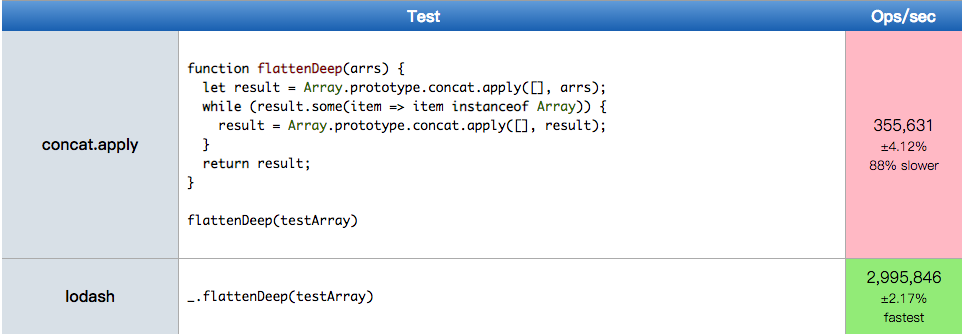

> 因为球是圆的，所以不论发生什么都有可能，对这点我是深信不疑的，但最近我总是在怀疑，JavaScript也是圆的！

## 什么是“黑话”
黑话，本指旧时江湖帮会人物的暗语、暗号，往往见于小说，后指流行于某一特殊行业中，非局外人所能了解的语言。而本文涉及到的“黑话”，其实是一些利用语言的特征使用的一些不常见的奇淫技巧，JavaScript的语法是十分简单灵活的，在项目中建议大家遵从ESLint规范编写可维护性的代码，各路神仙们也应该进行自我约束，毕竟“黑话”也并不全是什么好的东西，如果很多话可以直接讲，何必拐弯抹角的去说呢？

## “算术”
算术中的位运算已被作者列为禁术，因此希望你在工程中使用位运算时，请确保你有充足的理由使用，并在需要时写好Hack注释。

以下知识点会涉及一些原码、反码与补码的概念，请参考文章[原码、反码与补码的产生](https://vv13.cn/posts/Algorithm/%E5%8E%9F%E7%A0%81%E3%80%81%E5%8F%8D%E7%A0%81%E3%80%81%E4%B8%8E%E8%A1%A5%E7%A0%81/)。

### !与!!
`!`为逻辑非操作符，可以应用于ECMAScript中的任何值，无论这个值是什么类型，它会被强制转化为一个布尔值变量，再对其值取反。

`!!`只是单纯的将操作数执行两次逻辑非，它能将任意类型的值转化为相应的布尔值，它包含的步骤为：
1. 将一个值转化为布尔值；
2. 将其取反；
3. 再次取反。

假设你需要通过一个布尔型变量表示是否有id值，以下写法推荐你使用最后一种方式来进行转化：
```
const enable1 = !!id；
const enable2 = id ? true : false;
const enable3 = Boolean(id);
```

### ~ 与 ~~
`~`表示按位取反，`~5`的运行步骤为：
1. 转为一个字节的二进制表示：00000101，
2. 按位取反：11111010
3. 取其反码：10000101
4. 取其补码：10000110
5. 转化为十进制：-6

`~~`它代表双非按位取反运算符，如果你想使用比Math.floor()更快的方法，那就是它了。需要注意，对于正数，它向下取整；对于负数，向上取整；非数字取值为0，它具体的表现形式为：

```
~~null;      // => 0
~~undefined; // => 0
~~Infinity;  // => 0
--NaN;       // => 0
~~0;         // => 0
~~{};        // => 0
~~[];        // => 0
~~(1/0);     // => 0
~~false;     // => 0
~~true;      // => 1
~~1.9;       // => 1
~~-1.9;      // => -1
```

### +
在变量值前使用+的本意是将变量转换为数字，在一个函数接受数字类型的参数时特别有用：

```
+'1' // 1
+'-1' // '-1
+[] // 0
+{} // NaN
```

根据观察，`+a`与`a * 1`结果类似。除此之外，使用+也可以作为立即执行函数：`+function() {}()`，等效于`(function(){})()`。

字符串与数字相加时会将数值默认转为字符串，因此有了一下将数字转为字符串的快捷方法：`'' + 1`。

### & 与 &&
如何你是从类C语言过来的话，请抛弃之前的刻板印象：&可以充当逻辑操作符号。在JavaScript中，&只能进行位运算。

`&`，它表示按位与，此运算符需要两个数字并返回一个数字。如果它们不是数字，则会转换为数字。如果执行`7 & 3`， 则会经过以下步骤：

1. 先转换为2进制： `111 & 11`
2. 比较结果为：`011`
3. 将二进制转回十进制，因此：`7 & 3 = 3`

它也可用于基偶数判断：`const isOdd = num => !!(num & 1);`

`&&`，表示逻辑与，通常用于if条件判断，可跟你想象的不太一样，&&并不是单纯的返回true或者false，而是依据：
1. 若第一个表达式为false，则返回第一个表达式；
2. 若第一个表达式为true，返回第二个表达式。
在这里举几个例子：
```
0 && false          0 (both are false-y, but 0 is the first)
true && false       false (second one is false-y)
true && true        true (both are true-y)
true && 20          20 (both are true-y)
```

`&&`可以连接多个操作符，如：`a && b && c && d`，返回值的规则与上面一样。除此以外，它还经常被作为短路逻辑使用：若前面表达式不是truthy，则不会继续执行之后的表达式。如在取一个对象的属性，我们需要先判断是否为空才能进行取值，否则会抛出Uncaught TypeError，这种情况下一般我们也会通过逻辑或，给与表达式一个默认值：
```
const value = obj && obj.value || false
```
当JavaScript压缩工具遇到if判断时，也会使用&&短路逻辑从而节省内存空间：
```
// before
if (test) { alert('hello') }
// after
test && alert('hello')
```

### | 与 ||
它们与`&`和`&&`使用方法很相似，不同的是它们表示的是逻辑或，因此使用`|`会进行按位或运算，而`||`会返回第一个Truthy值。

使用||进行默认值赋值在JavaScript中十分常见，这样可以省略很多不必要的if语句，比如：
```
// before
let res;
if (a) {
  res = a;
} else if (b) {
  res = b;
} else if (c) {
  res = c;
} else {
  res = 1;
}

// after
const res = a || b || c || 1;
```

### == 与 ===

`==`为相等运算符，操作符会先将左右两边的操作数强制转型，转换为相同的操作数，再进行相等性比较。

`===`为全等运算符，它除了在比较时不会将操作数强制转型，其余相等判断与`==`一致。

简单而言，`==`用于判断值是否相等，`===`判断值与类型是否都相等，因此使用全等运算符判断操作数会更准确，新手也在学习JavaScript接收到的前几条Tips就是避免使用相等运算符，真的是这样吗？没错，这样能确保在你不彻底熟悉语言的情况下，尽可能的去避免犯错，但是我们也应该清楚在哪些情况下应该使用相等运算符，规则往往只针对于新手，而对聪明的你来说，最重要的是要清楚自己在做什么。

相等操作符对于不同类型的值，进行的比较如下图所示：

<table class="standard-table">
<thead>
<tr>
<th scope="row">&nbsp;</th>
<th colspan="7" style="text-align: center;" scope="col">B</th>
</tr>
</thead>
<tbody>
<tr>
<th scope="row">&nbsp;</th>
<td>&nbsp;</td>
<td style="text-align: center;">Undefined</td>
<td style="text-align: center;">Null</td>
<td style="text-align: center;">Number</td>
<td style="text-align: center;">String</td>
<td style="text-align: center;">Boolean</td>
<td style="text-align: center;">Object</td>
</tr>
<tr>
<th colspan="1" rowspan="6" scope="row">A</th>
<td>Undefined</td>
<td style="text-align: center;"><code>true</code></td>
<td style="text-align: center;"><code>true</code></td>
<td style="text-align: center;"><code>false</code></td>
<td style="text-align: center;"><code>false</code></td>
<td style="text-align: center;"><code>false</code></td>
<td style="text-align: center;"><code>IsFalsy(B)</code></td>
</tr>
<tr>
<td>Null</td>
<td style="text-align: center;"><code>true</code></td>
<td style="text-align: center;"><code>true</code></td>
<td style="text-align: center;"><code>false</code></td>
<td style="text-align: center;"><code>false</code></td>
<td style="text-align: center;"><code>false</code></td>
<td style="text-align: center;"><code>IsFalsy(B)</code></td>
</tr>
<tr>
<td>Number</td>
<td style="text-align: center;"><code>false</code></td>
<td style="text-align: center;"><code>false</code></td>
<td style="text-align: center;"><code>A === B</code></td>
<td style="text-align: center;"><code>A === ToNumber(B)</code></td>
<td style="text-align: center;"><code>A=== ToNumber(B) </code></td>
<td style="text-align: center;"><code>A=== ToPrimitive(B)</code></td>
</tr>
<tr>
<td>String</td>
<td style="text-align: center;"><code>false</code></td>
<td style="text-align: center;"><code>false</code></td>
<td style="text-align: center;"><code>ToNumber(A) === B</code></td>
<td style="text-align: center;"><code>A === B</code></td>
<td style="text-align: center;"><code>ToNumber(A) === ToNumber(B)</code></td>
<td style="text-align: center;"><code>ToPrimitive(B) == A</code></td>
</tr>
<tr>
<td>Boolean</td>
<td style="text-align: center;"><code>false</code></td>
<td style="text-align: center;"><code>false</code></td>
<td style="text-align: center;"><code>ToNumber(A) === B</code></td>
<td style="text-align: center;"><code>ToNumber(A) === ToNumber(B)</code></td>
<td style="text-align: center;"><code>A === B</code></td>
<td style="text-align: center;"><code>ToNumber(A) == ToPrimitive(B)</code></td>
</tr>
<tr>
<td>Object</td>
<td style="text-align: center;"><code>false</code></td>
<td style="text-align: center;"><code>false</code></td>
<td style="text-align: center;"><code>ToPrimitive(A) == B</code></td>
<td style="text-align: center;"><code>ToPrimitive(A) == B</code></td>
<td style="text-align: center;"><code>ToPrimitive(A) == ToNumber(B)</code></td>
<td style="text-align: center;">
<code>A === B</code>
</td>
</tr>
</tbody>
</table>

针对于undefined与null：**undefined与null互等，与其余任意对象都不相等**，因此在某些lib里，你可能会看到如下写法：

```
if (VAR == undefined) {}
if (VAR == null) {}
```

它等效于：

```
if (VAR === undefined || VAR === null) {}
```

对于 `'', false, 0`而言，他们都属于[Falsy](https://developer.mozilla.org/en-US/docs/Glossary/Falsy)类型，通过Boolean对象都会转换为假值，而通过`==`判断三者的关系，他们总是相等的，因为在比较值时它们会因为类型不同而都被转换为false值：

```
console.log((false == 0) && (0 == '') && ('' == false)) // true
```

或者有时候我们希望利用强转特性比较字符串与数字：

```
console.log(11 == '11') // true
console.log(11 === '11') // false
```

### ^
按位异或运算符，对比每一个比特位，当比特位不相同时则返回1，否则返回0。很少人在Web开发中使用此运算符吧，除了传说中的一种场景：交换值。

若要交换a与b的值，如果可以的话推荐你使用：
```
[a, b] = [b, a];
```
或者新建一个c，用于存储临时变量，如果你遇到有人这样书写：
```
// 异或运算，相同位取0，不同位取1，a ^ b ^ b = a， a ^ a ^ b = b
a = a ^ b
b = a ^ b
a = a ^ b
```
这样通过异或运算进行交换两个数字型变量，请原谅他并忽视它，他只可能是一个醉心于魔法的初心者，并祝愿他早日发现，简洁易读的函数才是最佳实践。

### >>> 0
无符号右移运算，对最高位的符号位不作特殊处理，将整体二进制码向右移动，舍弃低位，高位以 0 进行补充，我们以 1 byte 大小的的整数进行举例：
- `3 >>> 1`等价于`0000 0011`向右移动 1 位：`000 0001`，然后高位补0:`0000 0001`，即`3 >>> 1 = 1`

在 js 中，我们总能发现一些使用`>>> 0`的 Hack 代码，其中核心特性就是无符号右移 0 位可以将所以类型的值都转化为 number 类型做统一处理，且非 number 类型转换为 0，以下大概列了一些基本用法：

| 类型     | 操作                                                | 示例                                           |
|----------|-----------------------------------------------------|------------------------------------------------|
| 正整数   | 不做任何操作                                        | `1 >>> 0 = 1`                                  |
| 负整数   | 取负数的补码的值                                    | `-1 >>> 0 = 4294967295`                        |
| 布尔值   | 转化为 1 or 0                                       | `true >>> 0 = 1`、`false >>> 0 = 0`            |
| 字符串   | 若isNaN(str)，值为 0；否则值为`parseInt(str) >>> 0` | `'1' >>> 0 = 1`、`'s' >>> 0 = 0`                         |
| 浮点数   | 舍弃掉小数位，然后再执行整数移位操作                | `1.1 >>> 0 = 1 >>> 0`、`-1.1 >>> 0 = -1 >>> 0` |
| 其他对象 | 统一值为0                                           | `[] >>> 0 = 0`、`undefined >>> 0 = 0`、...     |

### ..
在JavaScipt整数和浮点数都属于`Number`类型，所有数字都以64位浮点数的形式储存，因此在解析语句时允许数组后面跟着一个小数点（`1. === 1`），可这样其实会引发一个问题，解释器无法解析`1.toString()`这样的语句，会抛出：`Uncaught SyntaxError`，此时表达式中的`.`并没有视为属性访问器，而是与1结合为浮点数`1.`，所以程序会报错，`1.toString()`等同于`1toString()`。

为了更便于理解，可以记住这个规则：在解释器眼中，Number型表达式的出现的第一个`.`为浮点数的小数分隔符号，第二个`.`为属性访问器。比如`1.0.toString()`与`1..toString()`这样的语法都能正常执行。需要注意的是变量与表达式的区别，若将Number型表达式赋值给变量，通过变量是可以直接调用原型方法的，因为此时的`.`没有歧义。

这样的松散类型结构确实很使人产生误解，在程序中我们都应该规避这样的歧义性语句，通过括号消除数值表达式的歧义`(1).toString()`，而不是为了耍酷使用`1..toString()`。

### void
根据MDN中的定义：`void对给定的表达式进行求值，然后返回undefined`，我们可以有很多种方式去理解这句话。

首先它可以作为undefined的替代品，由于undefined不是保留字，它其实是一个全局变量值，因此我们可以对其进行改变，程序可能会出现不稳定的状态，在ES5中已经是一个只读属性了，但是在局部作用域中，还是有被重载的可能（你可能也有被害妄想症）：
```
(function() {
  const undefined = 'hello';
  console.log(undefined); // hello
})();
```

其次，我们可以在函数前面加上void关键字，表示函数没有返回值，但是不必在每一个函数都加上，这不符合JavaScript的代码风格，利用此特性我们可以用于执行IIFE（立即执行函数），让我们来看以下示例：
```
const arrs = []
(function() {
  console.log('hello')
})()
```

若你不习惯于写分号，那就极有可能遇到过这种报错：`Uncaught TypeError: [] is not a function`，这是由于编辑器在进行minify的时候无法进行正确的分词，这时通过void就可以解决此类问题，解决了分词的问题，也使立即执行函数调用更加优雅：
```
const arrs = []
void function() {
  console.log('hello')
}()
```
在有时我们不希望a标签进行跳转，以下是一些常用方法：
```html
<!-- 使用preventDefault -->
<a id="a" href="">hello</a>
<script>
  a.addEventListener('click', e => e.preventDefault());
</script>

<!-- 使用return false -->
<a href="" onclick="return false;">hello</a>
```

当我们给href值设置为`undefined`，也可以避免a标签的默认跳转行为：
```
<a href="javascript: void 0;" onclick="return false;">hello</a>
```

### 数值表示法

#### 3e9

科学计数法是一种数学术语，将一个数表示为a乘以10的n次方，如光速30万公里每秒，在计算中通常将米做单位，则记为：300000000m/s，而在JavaScript中我们可使用科学计数法 `3e9`表示。

在这里举几个科学计数法的示例：

```
1e5; // 100000
2e-4; // 0.0002
-3e3; // -3000
```

Number对象有`toExponential(fractionDigits)`方法以科学计数法返回该数值的字符串表示形式，参数fractionDigits可选，用于用来指定小数点后有几位数字，例如：`(179000).toExponential(); // "1.79e+5"`。

以下情况JavaScript会自动将数值转为科学计数法表示：

1. 小数点前的数字多于21位。
2. 数值小于1且小数点后的零多于5个，如`0.0000001`。

#### .5px

通常某些人习惯省略0.开头的数字，常见于数值计算、css属性中，比如`0.5px`可直接写为`.5px`，`0.2 * 0.3`可写为： `.2 * .3`

#### 0x、0o和0b

在十进制的世界里呆久了，请不要忘记还有其他进制的存在，在计算机中它们是同地位的。JavaScript提供了以下进制的表示方法：

- 二进制：只用0和1两个数字，前缀为`0b`，十进制13可表示为`0b1101`
- 八进制：只用0到7八个数字，前缀为`0o、0`，十进制13可表示为`0o15、015`
- 十六进制：只用0到9的十个数字，和a到f六个字母，前缀为`0x`，十进制13可表示为`0xd`

默认情况下，JavaScript 内部会自动将八进制、十六进制、二进制转为十进制再进行运算。从十进制转其他进制请查阅`toString`方法，从其他进制转十进制请查阅`parseInt`方法，从其他进制转其他进制请先转为十进制再转为其他方法。


## “话术”
### Array.prototype.sort

Array.prototype.sort()默认根据字符串的Unicode编码进行排序，具体算法取决于实现的浏览器，在[v8引擎](https://github.com/v8/v8/blob/b8a5ae4749be1b34246957982e205517737d814b/src/js/array.js#L545)中，若数组长度小于10则使用从插入排序，大于10使用的是快排。

而sort支持传入一个`compareFunction(a, b)`的参数，其中a、b为数组中进行比较的两个非空对象(所有空对象将会排在数组的最后)，具体比较规则为：

- 返回值小于0，a排在b的左边
- 返回值等于0，a和b的位置不变 
- 返回值大于0，a排在b的右边

因此利用sort即可写一个打乱数组的方法：

```
[1,2,3,4].sort(() => .5 - Math.random())
```

但是以上的实现并不是完全随机的，究其原因，还是因为排序算法的不稳定性，导致一些元素没有机会进行比较，具体请参考[问题](https://www.zhihu.com/question/68330851)，在抽奖程序中若要实现完全随机，请使用 **Fisher–Yates shuffle** 算法，以下是简单实现：

```
function shuffle(arrs) {
  for (let i = arrs.length - 1; i > 0; i -= 1) {
    const random = Math.floor(Math.random() * (i + 1));
    [arrs[random], arrs[i]] = [arrs[i], arrs[random]];
  }
}
```

### Array.prototype.concat.apply
apply接收数组类型的参数来调用函数，而concat接收字符串或数组的多个参数，因此可使用此技巧将二维数组直接展平：

```
Array.prototype.concat.apply([], [1, [2,3], [4]])
```

而通过此方法也可以写一个深层次遍历的方法：

```
function flattenDeep(arrs) {
  let result = Array.prototype.concat.apply([], arrs);
  while (result.some(item => item instanceof Array)) {
    result = Array.prototype.concat.apply([], result);
  }
  return result;
}
```

经过测试，效率与lodash对比如下：



对上述方法中的`Array.prototype.concat.apply([], target)`亦可以写成：`[].concat(...target)`。

### Array.prototype.push.apply
在es5中，若想要对数组进行拼接操作，我们习惯于使用数组中的concat方法：
```
let arrs = [1, 2, 3];
arrs = arrs.concat([4,5,6]);
```
但还有酷的方法，利用apply方法的数组传参特性，可以更简洁的执行拼接操作：
```
const arrs = [1, 2, 3];
arrs.push.apply(arrs, [4, 5, 6]);
```

### Array.prototype.length
它通常用于返回数组的长度，但是也是一个包含有复杂行为的属性，首先需要说明的是，**它并不是用于统计数组中元素的数量**，而是代表数组中最高索引的值：
```
const arrs = [];
arrs[5] = 1;
console.log(arrs.length); // 6
```
另外，length长度随着数组的变化而变化，但是这种变化仅限于：**子元素最高索引值的变化**，假如使用`delete`方法删除最高元素，length是不会变化的，因为最高索引值也没变：
```
const arrs = [1, 2, 3];
delete arrs[2]; // 长度依然为3
```
length还有一个重要的特性，那就是允许你修改它的值，若修改值小于数组本身的最大索引，则会对数组进行部分截取：
```
const arrs = [1, 2, 3, 4];
arrs.length = 2; // arrs = [1, 2]
arrs.length = 0; // arrs = []
```
若赋予的值大于当前最大索引，则会得到一个稀疏数组：
```
const arrs = [1, 2];
arrs.length = 5; // arrs = [1, 2,,,,]
```
若将值赋为0，则执行了**清空数组**的操作:
```
const arrs = [1, 2, 3, 4];
arrs.length = 0; // arrs = []
```
使用此方法会将数组中的所有索引都删除掉，因此也会影响其他引用此数组的值，这点跟使用`arrs = []`有很大的区别：
```
let a = [1,2,3];
let b = [1,2,3];
let a1 = a;
let b1 = b;
a = [];
b.length = 0;
console.log(a, b, a1, b1); // [], [], [1, 2, 3], []
```
在对length进行修改的时候，还需要注意：
- 值需要为正整数
- 传递字符串会被尝试转为数字类型

### Object.prototype.toString.call
每个对象都有一个toString()，用于将对象以字符串方式引用时自动调用，如果此方法未被覆盖，toString则会返回[object type]，因此`Object.prototype.toString.call`只是为了调用原生对象上未被覆盖的方法，call将作用域指向需要判断的对象，这样一来就可以通过原生的toString方法打印对象的类型字符串： `Object.prototype.toString.call([]) => "[object Array]" `，利用这个特性，可以较为精确的实现类型判断。

在ES3中，获取到的type为内部属性[[Class]]属性，它可以用来判断一个原生属性属于哪一种内置的值；在ES5中新增了两条规则：若this值为null、undefined分别返回： [object Null]、[object Undefined]；在ES6中不存在[[Class]]了，取而代之的是一种内部属性：[[NativeBrand]]，它是一种标记值，用于区分原生对象的属性，具体的判断规则为：

```
19.1.3.6Object.prototype.toString ( )
When the toString method is called, the following steps are taken:

If the this value is undefined, return "[object Undefined]".
If the this value is null, return "[object Null]".
Let O be ! ToObject(this value).
Let isArray be ? IsArray(O).
If isArray is true, let builtinTag be "Array".
Else if O is a String exotic object, let builtinTag be "String".
Else if O has a [[ParameterMap]] internal slot, let builtinTag be "Arguments".
Else if O has a [[Call]] internal method, let builtinTag be "Function".
Else if O has an [[ErrorData]] internal slot, let builtinTag be "Error".
Else if O has a [[BooleanData]] internal slot, let builtinTag be "Boolean".
Else if O has a [[NumberData]] internal slot, let builtinTag be "Number".
Else if O has a [[DateValue]] internal slot, let builtinTag be "Date".
Else if O has a [[RegExpMatcher]] internal slot, let builtinTag be "RegExp".
Else, let builtinTag be "Object".
Let tag be ? Get(O, @@toStringTag).
If Type(tag) is not String, set tag to builtinTag.
Return the string-concatenation of "[object ", tag, and "]".
This function is the %ObjProto_toString% intrinsic object.

NOTE
Historically, this function was occasionally used to access the String value of the [[Class]] internal slot that was used in previous editions of this specification as a nominal type tag for various built-in objects. The above definition of toString preserves compatibility for legacy code that uses toString as a test for those specific kinds of built-in objects. It does not provide a reliable type testing mechanism for other kinds of built-in or program defined objects. In addition, programs can use @@toStringTag in ways that will invalidate the reliability of such legacy type tests.

```

### Object.create(null)

用于创建无“副作用”的对象，也就是说，它创建的是一个**空对象**，不包含原型链与其他属性。若使用`const map = {}`创建出来的对象相当于Object.create(Object.prototype)，它继承了对象的原型链。

### JSON.parse(JSON.stringify(Obj))
很常用的一种深拷贝对象的方式，将对象进行JSON字符串格式化再进行解析，即可获得一个新的对象，要注意它的性能不是特别好，而且无法处理闭环的引用，比如：

```
const obj = {a: 1};
obj.b = obj;
JSON.parse(JSON.stringify(obj)) // Uncaught TypeError: Converting circular structure to JSON
```

这样通过JSON解析的方式其实性能并不高，若对象可通过浅拷贝复制请一定使用浅拷贝的方式，不管你使用`{...obj}`还是`Object.assign({}, obj)`的方式，而如果对性能有要求的情况下，请不要再造轮子了，直接使用npm:clone这个包或是别的吧。

### 生成[0, 1, ..., N-1]
依稀记得在Python中生成列表的语法是多么简洁：`[ x for x in range(1, 10) ]`，那么在JavaScript如何进行初始化1~10的有序序列呢？

行车有规范，直接使用`new Array(10)`进行初始化并`.map`是不可取的，因为这样只设置了数组的length字段：
```
Object.getOwnPropertyNames([1, 2, 3]) // ["0", "1", "2", "length"]

const a = new Array(3) // [undefined, undefined, undefined]
Object.getOwnPropertyNames(a) // ["length"]
```

这样会导致`map`、`filter`等迭代方法无效，当然使用`fill`填充后即可正常操作数组项，但是在这里会用其他方法解决。

在以前，大家喜欢使用这样的Hack技巧去初始化固定长度的数组：`Array.apply(null, { length: 3 })`，需要特意说明的是，`{ length: 3 }`其实是一个类数组对象，Array.prototype.apply内部取参数可能是这样实现的：
```
for (let index = 0; i < arguments[1].length; index++) {
  // pass arguments[1][index]
}
```

正因如此，如果你基础没问题的话，就会发现上面的语句其实等效于：`Array(undefined, undefined, undefined)`，综上，生成0~10的序列语句可写为：
```
Array.apply(null, { length: 10 }).map((v, k) => k)
```

而对于ES6来讲，完全可以用`Array.from`来替代以上的语句的：
```
Array.from(new Array(10), (k, v) => v)
```

`Array.from`不仅接受字符串、Set、Map、类数组对象作为参数，凡是可迭代对象都可以，比如我们出于娱乐的目的使用生成器实现：
```
function* range(start, end) {
  for (let i = start; i < end; i++) {
    yield i
  }
}
Array.from(range(1, 10)) // [1, 2, 3, 4, 5, 6, 7, 8, 9]
[...range(1, 10)] // [1, 2, 3, 4, 5, 6, 7, 8, 9]
```


## “理论”
### Truthy与Falsy
对每一个类型的值来讲，它每一个对象都有一个布尔型的值，Falsy表示在Boolean对象中表现为false的值，在条件判断与循环中，JavaScript会将任意类型强制转化为Boolean对象。
以下这些对象在遇到if语句时都表现为Falsy：

```
if (false)
if (null)
if (undefined)
if (0)
if (NaN)
if ('')
if ("")
if (document.all)
```

document.all属于历史遗留原因，所以为false，它违背了JavaScript的规范，可以不管它，而NaN这个变量，千万不要用全等或相等对其进行判断，因为它发起疯来连自己都打：

```
console.log(NaN === 0) // false
console.log(NaN === NaN) // false
console.log(NaN == NaN) // false
```

但是我们可以使用Object.is方法进行判断值是否为NaN，它是ES6新加入的语法，用于比较两个值是否相同，它可以视为比全等判断符更为严格的判断方法，但是不可混为一谈：
```
Object.is(NaN, NaN) // true
Object.is(+0, -0) // false
```

而除了Falsy值，所有值都是Truthy值，在Boolean上下文中表现为true。

## 其他
上文主要总结了 JavaScript 中一些自己接触过的奇技淫巧，但其中只有少数知识点是值得深挖的，我们更应关注其中的原理而不是语法，以不变应万变。

## 参考资料
-  [https://modernweb.com/45-useful-javascript-tips-tricks-and-best-practices/](https://modernweb.com/45-useful-javascript-tips-tricks-and-best-practices/)
-  [https://dmitripavlutin.com/the-magic-behind-array-length-property/](https://dmitripavlutin.com/the-magic-behind-array-length-property/)
-  [https://medium.freecodecamp.org/9-neat-javascript-tricks-e2742f2735c3](https://medium.freecodecamp.org/9-neat-javascript-tricks-e2742f2735c3)
-  [https://stackoverflow.com/questions/7310109/whats-the-difference-between-and-in-javascript](https://stackoverflow.com/questions/7310109/whats-the-difference-between-and-in-javascript)
-  [http://javascript.ruanyifeng.com/grammar/number.html](http://javascript.ruanyifeng.com/grammar/number.html)
- [https://medium.freecodecamp.org/https-medium-com-gladchinda-hacks-for-creating-javascript-arrays-a1b80cb372b](https://medium.freecodecamp.org/https-medium-com-gladchinda-hacks-for-creating-javascript-arrays-a1b80cb372b)

