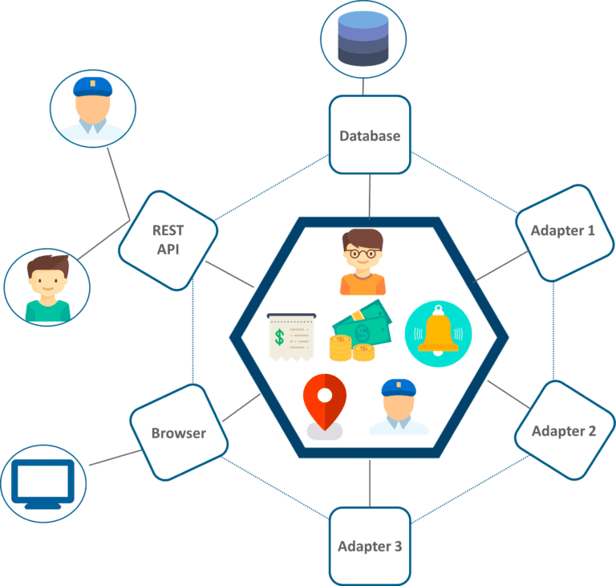
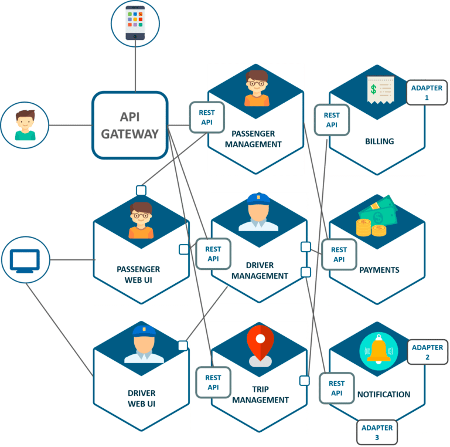
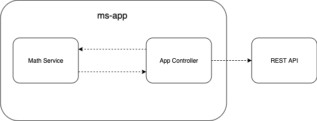
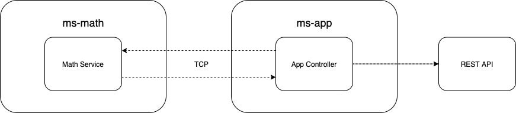
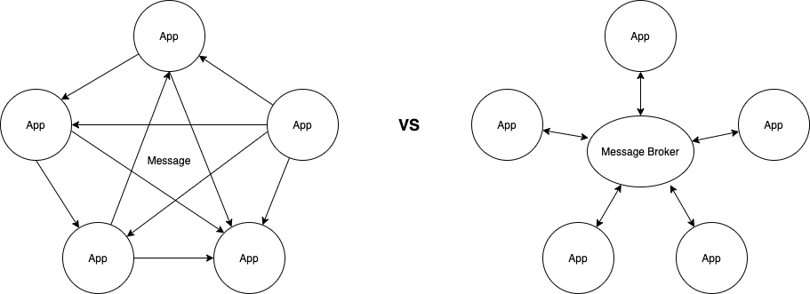

# 微服务简介

微服务架构（Microservice Architecture）是一种架构概念，旨在通过将功能分解到各个离散的服务中以实现对解决方案的解耦。

回到微服务的概念中，它不是具体指某一技术，而是关于某种架构风格的集合，因此微服务本身是没有明确定义的，但我们知道它是有不只一个的独立服务组成的一个整体架构。

作为 ThoughtWorks 的咨询师，我十分乐意推荐你阅读关于 Martin Fowler 的这篇关于 Microservices 的文章：

> [https://martinfowler.com/articles/microservices.html](https://martinfowler.com/articles/microservices.html)

## 最开始的单体应用

我们以类似于 Uber 的打车服务作为一个业务案例，由于初期团队规模小，业务量也不多，整个系统是如下的一个单体应用：



如上图所示，乘客和司机通过 REST API 进行交互，所有服务都请求的是一个数据库，并且所有服务，例如支付、订单、个人中心等都存在于一个框架服务之中，在早期的时候，这样的开发架构，对于一个创业型产品是十分常见的，集中管理、开发效率高，可是随着业务的不断扩展与量级的增大，慢慢的这个单体应用就变为了一个巨石应用，那我们再对其进行代码维护时，就很容易遇到以下的问题：

- 当我们对其中一个服务进行代码更新，那么整个系统所涉及到的测试、集成于部署都会重新执行，整个流程十分缓慢。
- 当某个服务出现问题的时候，整个服务器会变得不可用，由于在一个系统仓库中，修复 Bug 定位也十分困难。
- 扩展服务与引入新的特性会变得十分困难，期间可能会涉及到整个系统的重构，牵一发而动全身。
- ...

## 改头换面的微服务架构

为了解决当前的业务痛点，这家打车公司参考了 Amazon、Netflix 等巨头公司的应用架构，最终将其巨石应用按照微服务的架构进行重新设计：



在这个服务地图中，我们看到每个核心业务模块都单独拆分出来作为一个独立的服务，针对于用户还引入了 API 网关的概念用来导航到内部的服务。现在来看，这套微服务架构解决了一些曾经单体应用下存在的缺陷：

- 所有功能模块都是独立的，去除了服务间代码的相互依赖，增强了应用的扩展性
- 每个模块可以单独部署，修改起来缩短了应用的部署时间，也能更快的对错误进行定位

当然微服务也会带来更多的问题与挑战，这个我们就不在此展开讨论了。从这个例子可以看出，从一个单体应用迁移到微服务架构其实是一个服务演进的过程，任何架构不可能凭空出现，最佳的架构取决于有多么适合当前的业务模式。

## 微服务设计准则

微服务本身相较于传统架构，会带来许多优点，但同时又会增加额外的复杂度与管理成本，所以我一直比较信奉一句话：不要为了微服务而微服务。因此在架构初期，我倾向于按照单体应用的方式进行组织代码，通过清晰的拆包逻辑，将业务进行隔离，降低模块间的复杂度，然后到项目后期若在业务与具体架构上能与微服务设计理念契合，那时候我们再将模块拆分出去。

有一篇文章对于微服务的设计总结的很到位，在这里就不赘述了，直接推荐给大家吧：

> [https://medium.com/@WSO2/guidelines-for-designing-microservices-71ee1997776c](https://medium.com/@WSO2/guidelines-for-designing-microservices-71ee1997776c)

# 使用 Nest 开发微服务程序

相信大家对 NestJS 或多或少有一些了解，简单来概括的话，NestJS 是由 TypeScript 编写的一款 Node.js 服务端框架，底层的 HTTP Server 由 Express 提供支持，与 Koa、Express 不同的是，它更加注重架构设计，让原本松散的 JS 服务端工程开箱具备各种个样的设计模式与规范，并借鉴了来自 Angular 和 Spring Boot 等框架的各种设计模式，比如 DI、AOP、Filter、Intercept、Observable 等。

Nest 是一个渐进式的框架，它还内置了微服务的支持，我们完全可以使用它来尝试构建复杂的 Web 应用，接下来我会与大家一步步地来探索下如何从零开始搭建一个 Nest 微服务应用。

## 服务间通讯协议

Nest  内置了几种不同的微服务传输层实现，它们定义在 `@nestjs/microservices` 包的 `Transport` 模块内，我们简单的进行归类：

- 直接传输：TCP
- 消息中转：REDIS、NATS、MQTT、RMQ、KAFKA
- 远程过程调度：GRPC

我们必须选取一种通讯协议来作为彼此微服务间的通讯机制，对于 Nest 框架来说切换传输协议是十分快捷的十分方便，因此我们需要根据自身项目的特性来决定。在接下来的文章中，我会先直接选用 TCP 作为传输方式，然后再将其改为 Redis，最后讲一讲如何使用 gRPC 来完成调度，并对接入其他语言的服务进行实践。

## 服务间通讯模式

在 Nest microservice 中，通讯模式有两种：

- Request-response 模式，当我们需要在内部服务间交互讯息时使用，异步的 response 函数也是支持的，我们的返回结果甚至可以是一个 Observable 对象。
- Event-based 模式，当服务间是基于事件的时候—我们仅仅想发布事件，而不是订阅事件时，就不需要等待 response 函数的响应，此时就是 Event-based 模式就是最好的选择。

为了在微服务间进行准确的传输数据和事件，我们需要用到一个称作模式（pattern）的值，pattern 是由我们进行自定的一个普通的对象值，或者是字符串，模式相当于微服务之间交流的语言，当进行通讯时，它会被自动序列化并通过网络请求找到与之匹配的服务模块。

# 构建一个简单的 WordCount 服务

现在，我会带大家来一起实现一个微服务架的简单示例，假设需要为整个系统添加一个数据处理的模块，名为 math，其中有一个服务主要功能为 WordCount（词频统计），让我们来看看如何在 Nest 中进行构建。

我们首先在单体架构上进行功能实现：



其中，ms-app 通过对外暴露一个 REST API，curl 请求示例如下：

```jsx
curl --location --request POST 'http://localhost:3000/math/wordcount' \
--header 'Content-Type: application/json' \
--data-raw '{
    "text": "a b c c"
}'
```

了解了大概需要做的事情，现在让我们从零开始进行项目的搭建，执行以下脚本进行项目的初始化工作：

```jsx
npm i -g @nestjs/cli
nest new ms-app
cd ms-app && nest g service math
```

此时，Nest 会自动帮你生成 math 模块，并且将 MathService 作为 Provider 在 `app.module.ts` 进行引用。我们服务的核心功能为 WordCount，在编写函数之前我们不妨先给 service 加一条测试用例，用于定义我们预期的请求参数与返回格式：

```jsx
// math.service.spec.ts 
it('should be return correct number', () => {
  expect(service.calculateWordCount('a b c c')).toEqual({ a: 1, b: 1, c: 2 });
  expect(service.calculateWordCount('c c c d')).toEqual({ c: 3, d: 1 });
});
```

测试驱动开发的好处在此就不一一进行列举了，我们现在准备在 `math.service.ts` 中编写一个简单的  WordCount 方法，我们需要做的事情就是以空格分割文本中的每一个单词，然后进行单词：

```jsx
import { Injectable } from '@nestjs/common';

@Injectable()
export class MathService {
  calculateWordCount(str: string) {
    const words = str.trim().split(/\s+/);
    return words.reduce((a, c) => ((a[c] = (a[c] || 0) + 1), a), {});
  }
}
```

这时候，就可以在 `app.controller.ts` 中进行路由的设计了，我们首先在构造器中申明 mathService 服务，Nest 会通过依赖注入的方式进行实例初始化，然后进行路由的编写，代码如下：

```jsx
import { Controller, Post, Body } from '@nestjs/common';
import { MathService } from './math/math.service';

@Controller()
export class AppController {
  constructor(private readonly mathService: MathService) {}

  @Post('/math/wordcount')
  wordCount(@Body() { text }: { text: string }): { [key: string]: number } {
    return this.mathService.calculateWordCount(text);
  }
}
```

通过上述 curl 命令进行终端测试，返回结果如下：

```jsx
{"a":1,"b":1,"c":2}
```

# 使用微服务进行重构代码

因为种种原因，我们可能会面临微服务的拆分，也就是将 WordCount 作为微服务的方式进行交互：

- 模块改由其他团队维护
- 模块改由其他语言进行开发
- 为了更好的架构等

我们在这里使用 Nest 微服务默认的通讯协议为 TCP，此时的架构图为：



我们通过 `nest new ms-math` 创建一个新的服务，首先安装内置的微服务模块：

```jsx
yarn add @nestjs/microservices
```

然后我们改造 `src/main.ts` ，将以前创建普通实例的方法改为使用微服务的方式进行创建：

```jsx
import { NestFactory } from '@nestjs/core';
import { Transport, MicroserviceOptions } from '@nestjs/microservices';
import { AppModule } from './app.module';

async function bootstrap() {
  const app = await NestFactory.createMicroservice<MicroserviceOptions>(
    AppModule,
    {
      transport: Transport.TCP,
    },
  );
  app.listen(() => console.log('Microservice is listening'));
}
bootstrap();
```

此时，我们可以将 math.service 中的 `calculateWordCount` 函数拷贝到 `app.service.ts` ，然后再对 `app.controller.ts` 进行改造。在控制器中，我们不再使用 `@Get` 或是 `@Post` 进行暴露接口，而是通过 `@MessagePattern` 进行设置模式（pattern），供微服务间识别身份，来看一看我们优雅的代码：

```jsx
import { Controller } from '@nestjs/common';
import { AppService } from './app.service';
import { MessagePattern } from '@nestjs/microservices';

@Controller()
export class AppController {
  constructor(private readonly appService: AppService) {}

  @MessagePattern('math:wordcount')
  wordCount(text: string): { [key: string]: number } {
    return this.appService.calculateWordCount(text);
  }
}
```

此时微服务已经创建好了，我们来启动它，若你足够细心，应该能收到命令行的输出：`Microservice is listening` 。

此时，我们还需要改造原先的 ms-app 服务，我们将 math 目录先直接删除，因为我们已经不需要在这里调用 mathService了，同时删除 app.module.ts 与 app.controller.ts 中所有相关代码，然后安装微服务的依赖：

```jsx
yarn add @nestjs/microservices
```

改造第一步，我们先在程序中注册一个用于对微服务进行数据传输的客户端，在这里我们使用 `ClientsModule` 提供的 `register()` 方法进行 mathService 的注册：

```jsx
import { ClientsModule, Transport } from '@nestjs/microservices';

@Module({
  imports: [
    ClientsModule.register([
      { name: 'MATH_SERVICE', transport: Transport.TCP },
    ]),
  ]
  ...
})
```

模块注册成功后，我们就能在 app.controller 中使用依赖注入的方式进行引用：

```jsx
constructor(@Inject('MATH_SERVICE') private client: ClientProxy) {}
```

ClientProxy 对象有两个核心方法：

- `send()` ，请求响应模式下的消息发送方法，该方法会调用微服务并返回一个 Observable 对象的响应体，因此能很简单的去订阅该微服务返回的数据，需要注意的是，只有你对该对象进行订阅后，相应的消息体才会被发送。
- `emit()` ，基于事件的消息发送方法，无论你是否订阅数据，该消息都会被立即发送。

了解了一些基本的概念，现在我们来对 app.controller 中的路由进行一些改造：

```jsx
	@Post('/math/wordcount')
  wordCount(
    @Body() { text }: { text: string },
  ): Observable<{ [key: string]: number }> {
    return this.client.send('math:wordcount', text);
  }
```

此时启动 ms-app 服务，让我们再在终端通过相同的 curl 命令进行测试，预期会得到相同的结果。

### 尝试使用基于事件的传输方式

以上工程虽然已经满足了我们的微服务改造需求，为了学习使用，可以在这里再添加一个通过事件响应模型进行触发的数据，事件名称定为：`math:wordcount_log` ，首先在 ms-app 中的原 `/math/wordcount` 路由方法里添加一行事件触发代码：

```jsx
this.client.emit('math:wordcount_log', text)
```

然后打开 ms-math 服务，在 app.controller 中注册相应的订阅器：

```jsx
	@EventPattern('math:wordcount_log')
  wordCountLog(text: string): void {
    console.log(text);
  }
```

以上就是所有需要做的工作，现在执行 curl 命令，我们可以在 ms-math 服务的终端看到以下打印：

```jsx
receive: a b c c
```

# 使用 Redis 作为消息代理

在之前的章节中，我们构建了一个简单的微服务架构，微服务间使用 TCP 进行直接的传输通讯，那么在这一节中，我们准备将消息传输机制改为使用 Redis 作为消息代理进行转发，以此来使得我们的微服务更加健壮。

### 什么是消息代理

消息代理（Message broker）是一个中间程序模块，在计算机网络中用于交换消息，它是面向消息的中间件的建造模块，因此它的职责并不包括负责远程过程调度（RPC）。

消息代理也是一种架构模式，用于消息验证、变换、路由。调节应用程序的通信，极小化互相感知（依赖），有效实现解耦合。例如，消息代理可以管理一个工作负荷队列或消息队列，用于多个接收者，提供可靠存储、保证消息分发、以及事务管理。

### 为什么选用 Redis

上部分讲解了 Nest 框架对于消息协议的实现支持，目前支持以下：REDIS、NATS、MQTT、RMQ、KAFKA，在这些消息服务中切换本身就是十分方便的，而我选择 Redis 的原因主要有以下几点：

- Redis 本身足够轻量级与高效，使用率非常高，也比较受欢迎
- 在我自己的工程代码中，我的服务列表里本身就有 Redis 服务，我并不希望选择其他的服务单独作为消息代理，增加了服务依赖与管理成本。
- 我对 Redis 本身有一定的了解，而其他几个得的使用经验并不多。

### 服务架构的变化

如果你对为什么使用消息代理有疑问的话，那么我来给你画一张示意图：



### 代码实现

我们首先在项目相关文件夹下创建一个 `docker-compose.yml`，用于管理 Redis 服务：

```jsx
version: '3.7'
services:
  redis:
    image: redis:latest
    container_name: service-redis
    command: redis-server --requirepass rootroot
    ports:
      - "16379:6379"
    volumes:
      - ./data:/data
```

通过 `docker-compose up -d` 后，执行 `docker ps` 查看服务状态：

```jsx
CONTAINER ID        IMAGE               COMMAND                  CREATED             STATUS              PORTS                                NAMES
6faba303e0ae        redis:latest        "docker-entrypoint.s…"   9 minutes ago       Up 9 minutes        0.0.0.0:16379->6379/tcp              service-redis
```

首先我们在 ms-app 与 ms-math 中安装 Redis 依赖：

```jsx
yarn add redis
```

然后我们需要改的地方其实很少，首先就是在 ms-math 中的 bootstrap函数内，我们将 Transport 替换为 REDIS，并附上服务地址：

```jsx
// before
const app = await NestFactory.createMicroservice<MicroserviceOptions>(
    AppModule,
    {
      transport: Transport.TCP,
    },
  );

// after
const app = await NestFactory.createMicroservice<MicroserviceOptions>(
    AppModule,
    {
      transport: Transport.REDIS,
      options: {
        url: "redis://:rootroot@localhost:16379",
      }
    },
  );
```

这就是所有 ms-math 需要做的工作，然后打开 ms-app，在注册客户端的地方，我们也进行相应的替换：

```jsx
// before
ClientsModule.register([
      { name: 'MATH_SERVICE', transport: Transport.TCP },
    ]),

// after
ClientsModule.register([
      {
        name: 'MATH_SERVICE',
        transport: Transport.REDIS,
        options: {
          url: 'redis://:rootroot@localhost:16379',
        },
      },
    ]),
  ],
```

大功告成，通过 curl 进行相应的验证，我们依然能得到正确的输出。
